# lambda-pptr

Current project is just an experiment for running puppeteer in the AWS Lambda
environment.

## About

- [index.js](./index.js) is the entry point, the code in `handler` function is the
one that is executed when the lambda is invoked.
- Visit [current url](https://epgq5dsmc7.execute-api.us-west-2.amazonaws.com/default/lambda-pptr-experiment-container) to invoke the lambda function.
- The deployment happens automatically each time code lands on `main` branch, see [Deploy step in publish job](.github/workflows/publish.yml).

## Local smoke test

```bash
npm test
```

## AWS setup

<details>
 <summary>Setup Lambda functions and API Gateway</summary>

  ### Step 1 - search for lambda
  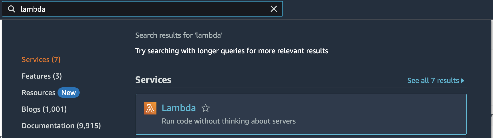

  ### Step 2 - click create function
  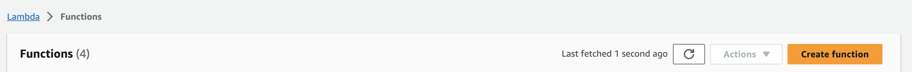

  ### Step 3 - set function name, click create
  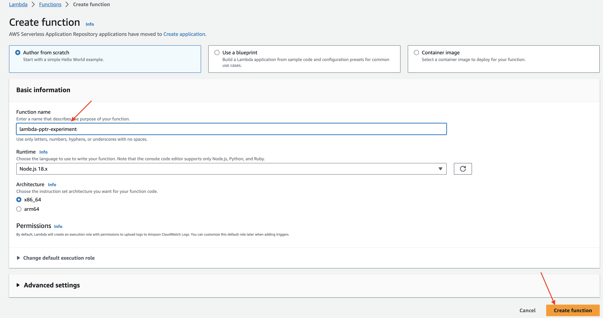

  ### Step 4 - add trigger
  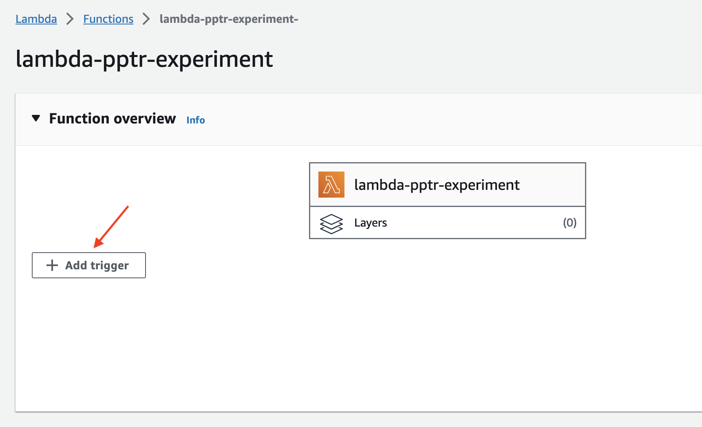

  ### Step 5 - select API Gateway, click add
  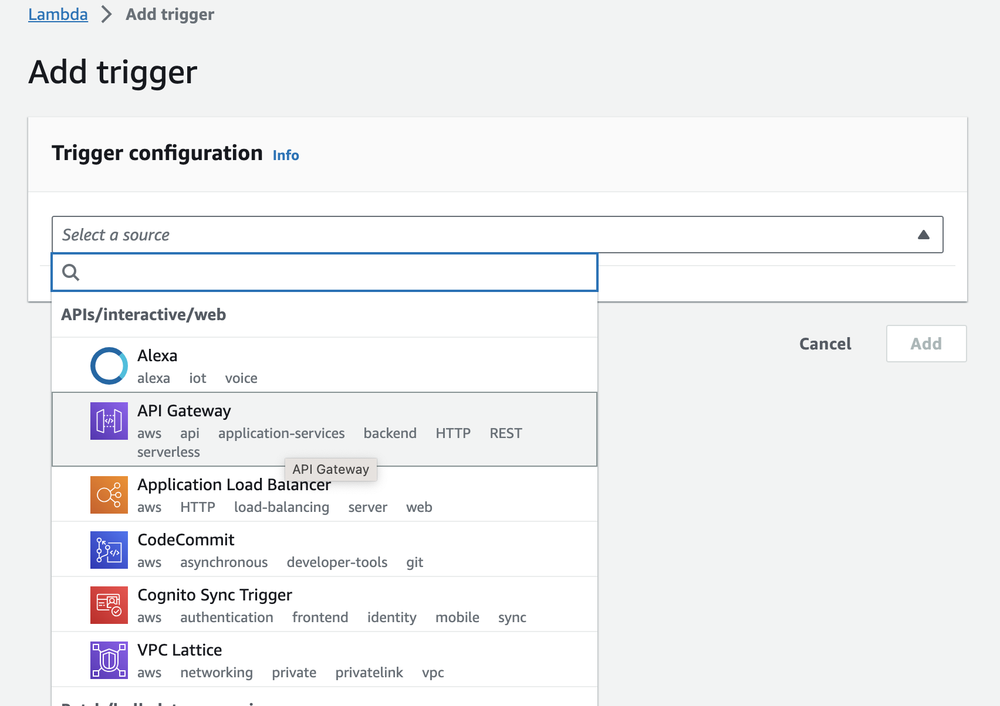

  ### Step 6 - open API Gateway
  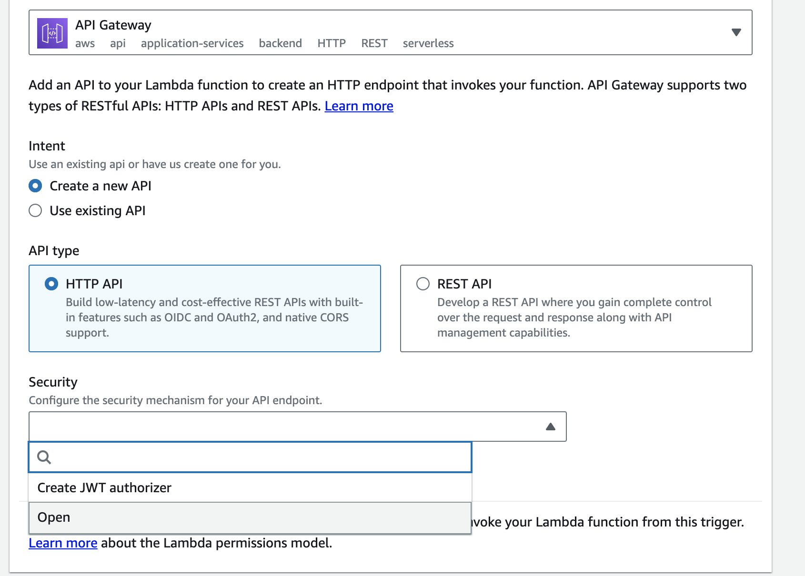

  ### Step 7 - API Gateway setup ready
  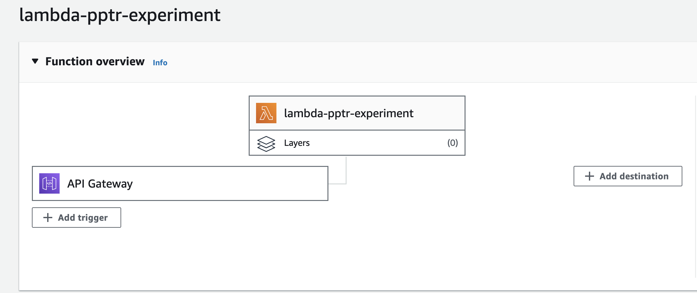

</details>


<details>
 <summary>Setup deployment pre-requisites</summary>

  ### Step 1 - search for IAM
  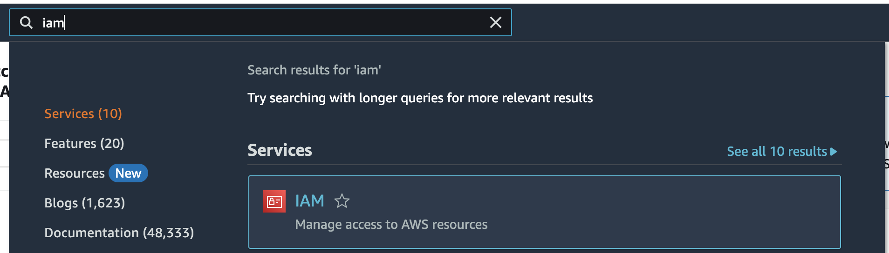

  ### Step 2 - click identity provider
  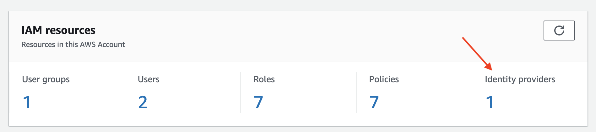

  ### Step 3 - click add provider
  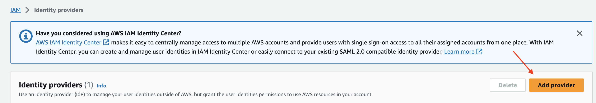

  ### Step 4 - setup provider
  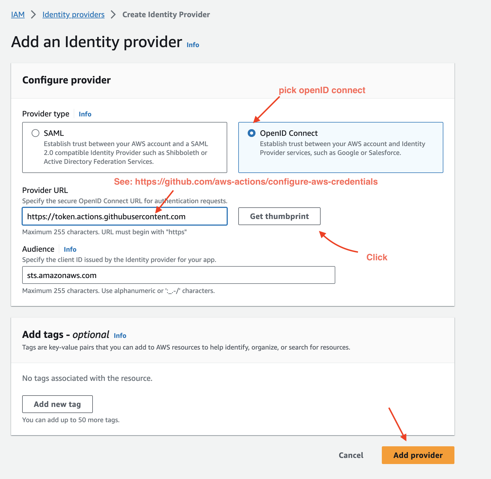

  ### Step 5 - get ARN
  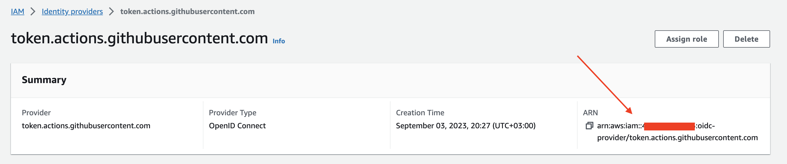

  ### Step 6 - search for roles
  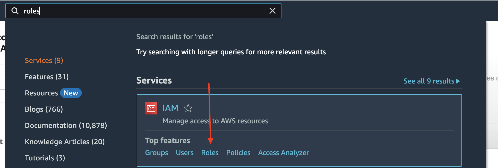

  ### Step 7 - create new role
  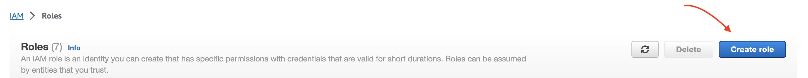

  ### Step 8 - create trusted entity
  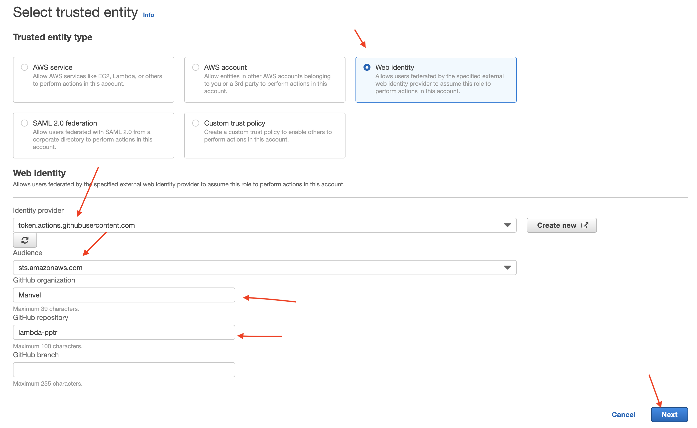

  ### Step 9 - create new policy
  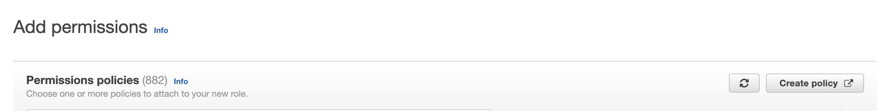

  ### Step 10 - update function code permission
  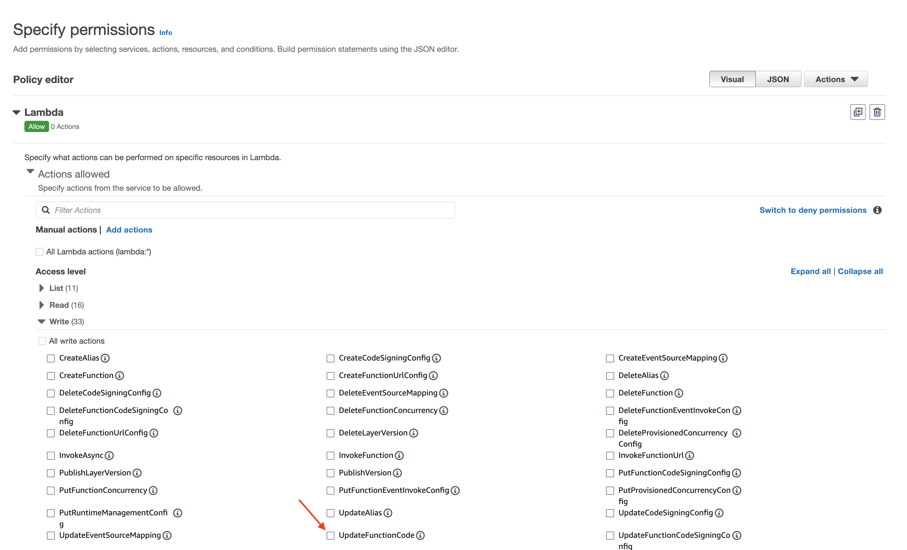

  ### Step 11 - specify ARN
  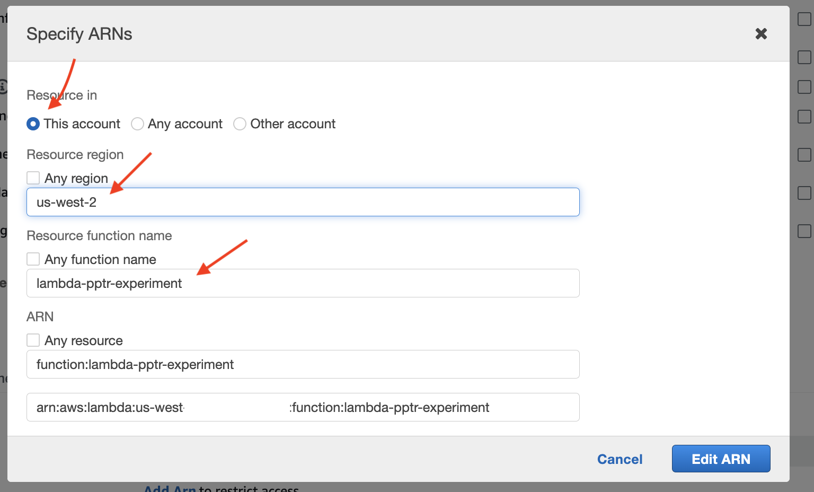

  ### Step 12 - create policy
  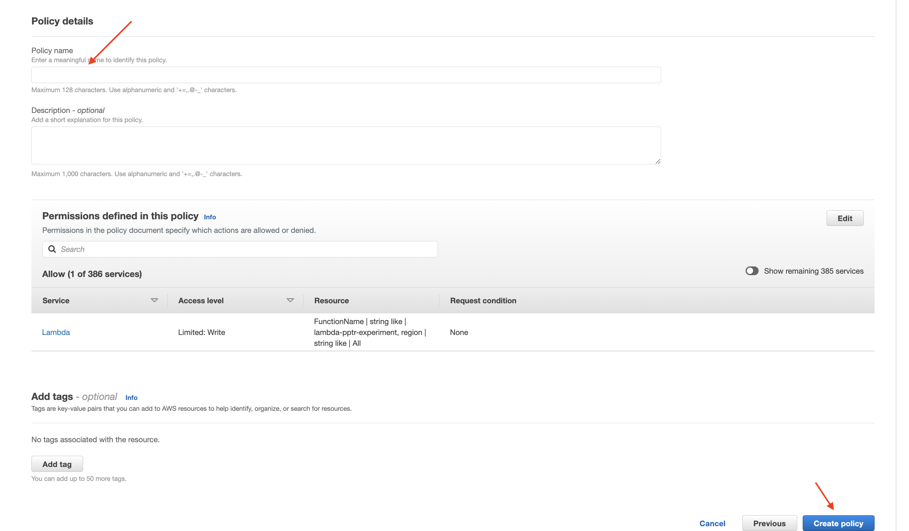

</details>
